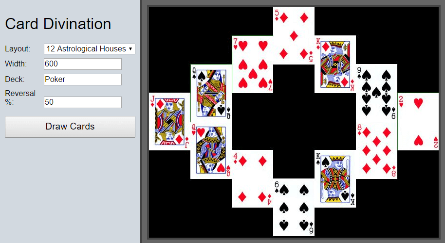

# Card Divination Web App

This was an experiment creating an FCGI app in Go.  It creates a JPEG of
cards in a number of configurable layouts.  

To avoid copyright issues, just a generic poker deck is provided in the 
repository, but my private installation has scans of various tarot and 
oracle decks.

Here's an example "Celtic Cross" layout produced by the tool:

The user interface is very basic (not even any CSS), as the point was
just to see a Go FCGI script run successfully on a shared host:

